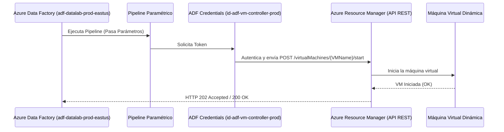
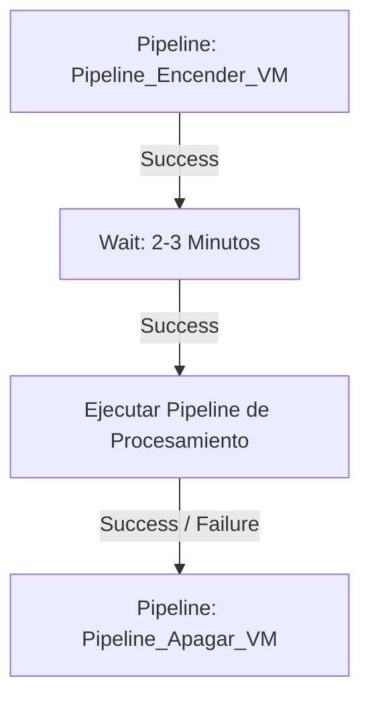

# Azure VM Orchestration from Azure Data Factory (ADF)

Este proyecto contiene la configuración y documentación necesaria para encender y apagar máquinas virtuales en Azure desde tus Azure Data Factories utilizando llamadas directas a la API REST de Azure con **Managed Identity** (Identidad Administrada).

La solución está completamente **parametrizada** para permitir la reutilización con cualquier máquina virtual y sigue de manera estricta el **Principio de Mínimo Privilegio (Least Privilege)**.

📥 **Repositorio de GitHub:** [reines-dev/azure-vm-orchestration-adf](https://github.com/reines-dev/azure-vm-orchestration-adf)

---

## 🚀 Arquitectura de la Solución



---

## 🛡️ Diseño de Seguridad y Mínimo Privilegio

Para proteger tu entorno de Azure, implementamos un esquema de seguridad endurecido:

1.  **Identidad Administrada Asignada por el Usuario:** Se utiliza una identidad independiente llamada `id-adf-vm-controller-prod` vinculada a tus Data Factories. Las identidades de sistema de los ADFs no tienen permisos directos en la VM.
2.  **Rol Personalizado (Custom Role):** La identidad utiliza un rol personalizado llamado **`Virtual Machine Power Controller (ADF)`**. A diferencia del rol de Colaborador (que permite borrar la VM o cambiar discos), este rol solo permite realizar tres acciones:
    *   `Microsoft.Compute/virtualMachines/read` (Consultar estado)
    *   `Microsoft.Compute/virtualMachines/start/action` (Encender)
    *   `Microsoft.Compute/virtualMachines/deallocate/action` (Apagar y liberar costos)
3.  **Ámbito Acotado (Scope):** Los permisos están asignados exclusivamente sobre el recurso individual de la VM `vm-datalab-prod-eastus2` y no sobre todo el grupo de recursos ni la suscripción.

*Definición del rol en el proyecto:* [custom-role-vm-controller.json](file:///D:/Proyectos/Personales/Encender maquina virtual desde adf/custom-role-vm-controller.json)

---

## 🎛️ Parametrización y Reutilización (Pipelines Paramétricos)

Los pipelines han sido estructurados para no depender de valores harcodeados. Cada pipeline define tres parámetros de entrada con los valores por defecto de tu máquina actual:

| Parámetro | Tipo | Descripción | Valor por Defecto |
| :--- | :--- | :--- | :--- |
| **`SubscriptionId`** | `string` | ID de la suscripción de Azure donde reside la VM | `<YOUR_SUBSCRIPTION_ID>` |
| **`ResourceGroup`** | `string` | Nombre del grupo de recursos de la VM | `rg-computelab-prod-eastus2` |
| **`VMName`** | `string` | Nombre de la Máquina Virtual a controlar | `vm-datalab-prod-eastus2` |

### URL Dinámica de la Actividad Web:
La actividad Web construye el endpoint de la API de Azure dinámicamente utilizando una expresión de concatenación:
```json
@concat('https://management.azure.com/subscriptions/', pipeline().parameters.SubscriptionId, '/resourceGroups/', pipeline().parameters.ResourceGroup, '/providers/Microsoft.Compute/virtualMachines/', pipeline().parameters.VMName, '/start?api-version=2021-11-01')
```

---

## 🛠️ Detalles de los Recursos

*   **Suscripción:** `<YOUR_SUBSCRIPTION_ID>`
*   **Máquina Virtual (VM) por Defecto:** `vm-datalab-prod-eastus2` (Resource Group `rg-computelab-prod-eastus2`, Región `eastus2`)
*   **Azure Data Factories (ADFs):**
    *   **Desarrollo/QA:** `adf-datalab-dev-eastus` (Resource Group `rg-datalab-dev-eastus`, Región `eastus`)
    *   **Producción:** `adf-datalab-prod-eastus` (Resource Group `rg-datalab-prod-eastus`, Región `eastus`)
*   **Identidad Administrada de Usuario:** `id-adf-vm-controller-prod` (Resource Group `rg-computelab-prod-eastus2`, Región `eastus2`)

---

## ⚙️ Estructura del Despliegue en el ADF de Producción (`adf-datalab-prod-eastus`)

Hemos automatizado y desplegado en tu nuevo ADF los siguientes recursos parametrizados:

1.  **Credencial Compartida:** `Credencial_Control_VM` (apunta a la identidad `id-adf-vm-controller-prod`).
2.  **Pipeline: `Pipeline_Encender_VM`** (Inicia la máquina virtual parametrizada).
    *   *Definición JSON en local:* [pipeline-start-vm.json](file:///D:/Proyectos/Personales/Encender%20maquina%20virtual%20desde%20adf/pipeline-start-vm.json)
3.  **Pipeline: `Pipeline_Apagar_VM`** (Apaga y desasigna la máquina virtual parametrizada).
    *   *Definición JSON en local:* [pipeline-stop-vm.json](file:///D:/Proyectos/Personales/Encender%20maquina%20virtual%20desde%20adf/pipeline-stop-vm.json)

---

## 📈 Diseño de Pipeline Recomendado

Para orquestar tus flujos de procesamiento de datos utilizando los pipelines de energía:



> [!TIP]
> **Reutilización:** Cuando utilices la actividad de **Execute Pipeline** en ADF para llamar a estos pipelines de control de energía, el panel de propiedades te solicitará pasar valores para los parámetros `SubscriptionId`, `ResourceGroup` y `VMName`. Puedes dejar los valores por defecto o ingresar dinámicamente los datos de cualquier otra máquina virtual de tu entorno.
